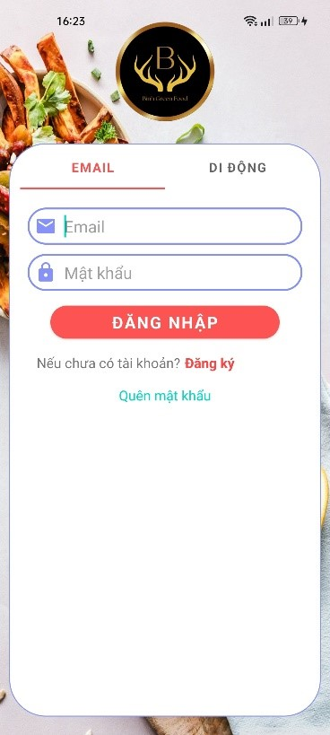
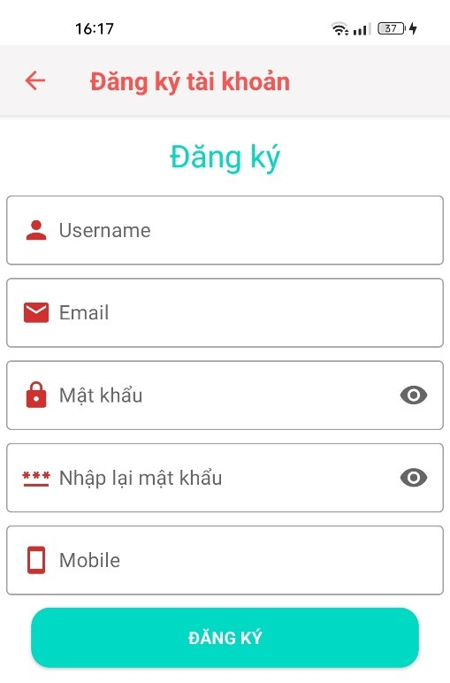
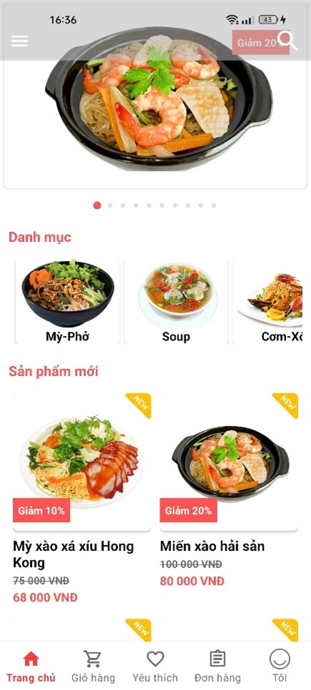
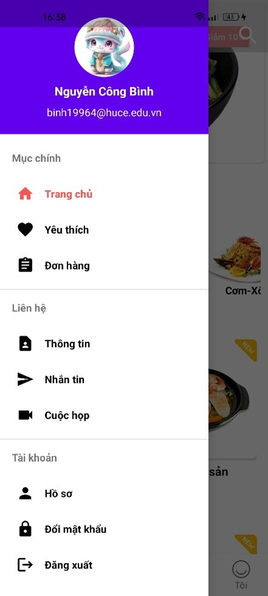
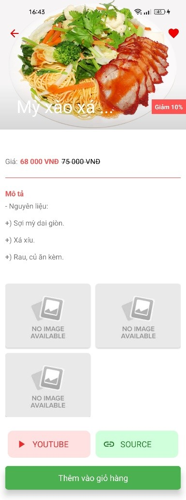
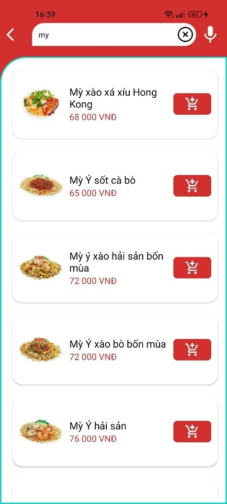
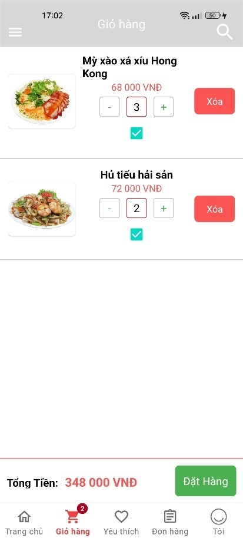

# Ứng dụng bán hàng online (Android App)
**1. Mô tả**
- Xây dựng ứng dụng bán hàng online trên nền tảng thiết bị di động (Android) với các chức năng chính sau:
    + Đăng ký, đăng nhập qua email, số điện thoại (OTP)
    + Phân quyền tài khoản
    + Quản lý sản phẩm, thể loại sản phẩm
    + Đặt hàng, thanh toán, tích hợp thanh toán online
    + Phát triển tính năng nhắn tin, meeting
    + ...
- Mục tiêu: Xây dựng một ứng dụng bán hàng online với thương hiệu riêng
- Công nghệ sử dụng:
    + PHP (API), Java (Android)
    + VSCode, Android Studio, MySQL

**2. Giao diện chính**
<h4 align="center">Đăng nhập</h4>

    
    

---

<h4 align="center">Đăng ký tài khoản</h4>

    

---

<h4 align="center">Trang chủ</h4>

    
      
    

---

<h4 align="center">Phân loại sản phẩm</h4>

    

---

<h4 align="center">Thông tin chi tiết sản phẩm</h4>

    

---

<h4 align="center">Tìm kiếm sản phẩm</h4>

    

---

<h4 align="center">Giỏ hàng</h4>

    

---

<h4 align="center">Nhắn tin</h4>

    

---

<h4 align="center">Meeting</h4>

    

<h4 align="center">...</h4>